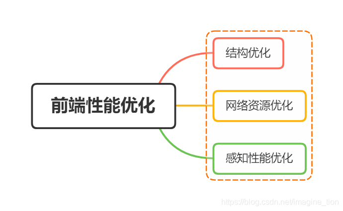
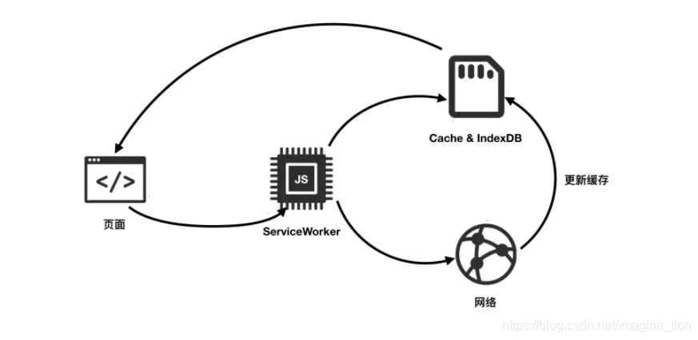

<!-- truncate -->

### 一、结构优化

#### 1.gzip压缩

- `gzip` 压缩效率非常高，通常可以达到 70% 的压缩率。

```javascript
//npm i -D compression-webpack-plugin
configureWebpack: config => {
  const CompressionPlugin = require('compression-webpack-plugin')
  config.plugins.push(new CompressionPlugin())
}
```

#### 2.预渲染

- 服务端渲染（SSR）

  简单理解是将组件或页面通过服务器生成html字符串，再发送到浏览器，最后将静态标记"混合"为客户端上完全交互的这个过程。

- 预渲染

  简单理解是将浏览器解析 `javascript` 动态渲染页面的这部分工作，在打包阶段就完成了（只构建了静态数据），换个说法在构建过程中，`webpack` 通过使用 `prerender-spa-plugin` 插件生成静态结构的 `html`。

```JavaScript
// npm i -D prerender-spa-plugin
 configureWebpack: config => {
   const path = require('path')
   const PrerenderSPAPlugin = require('prerender-spa-plugin')
   config.plugins.push(
     new PrerenderSPAPlugin({
       staticDir: path.join(__dirname, 'dist'),
       routes: ['/'],
       minify: {
         collapseBooleanAttributes: true,
         collapseWhitespace: true,
         keepClosingSlash: true,
         decodeEntities: true,
         sortAttributes: true,
       },
       renderer: new PrerenderSPAPlugin.PuppeteerRenderer({
         renderAfterDocumentEvent: 'render-event',
         renderAfterTime: 5000,
         // headless: false,
       }),
     })
   )
 }
```

注意：路由模式必须为 `history` ，如果不设置 `history` 模式，也能运行和生成文件，每个 `index.html` 文件的内容都会是一样的。

#### 3.去除 console.log

- 线上项目自然不应该被看到控制台的打印日志,所以我们需要将 `console.log` 都去除掉。

```JavaScript
//npm i -D terser-webpack-plugin 
 configureWebpack: config => {
   const TerserPlugin = require('terser-webpack-plugin')
   config.optimization.minimizer.push(
     new TerserPlugin({
       extractComments: false,
       terserOptions: { compress: { drop_console: true } },
     })
   )
 }
```

#### 4.去除 SourceMap

- 由于打包后的文件经过了压缩、合并、混淆、`babel`编译后的代码不利于定位分析`bug`。

```JavaScript
module.exports = {
  productionSourceMap: false,
}

```

#### 5.组件库的按需引入

- 组件库按需引入的方法，一般文档都会介绍。
- `element UI`库，用`babel-plugin-component`插件实现按需引入。
- 一般的组件库还是`babel-plugin-import`插件实现按需引入（其实`babel-plugin-component`插件是`element`用`babel-plugin-import`插件改造后特定给`element UI`使用）。

### 二、网络资源优化

#### 1.Service Worker

- `ServiceWorker` 是运行在浏览器背后的独立线程，它可以做许多事情，比如拦截客户端的请求、向客户端发送消息、向服务器发起请求等等，其中最重要的作用之一就是离线资源缓存。
- `ServiceWorker`  拥有对缓存流程丰富灵活的控制能力，当页面请求到 `ServiceWorker` 时，`ServiceWorker` 同时请求缓存和网络，把缓存的内容直接给用户，而后覆盖缓存。



注意：需要https才可以使用Service Worker。

#### 2.http缓存

- 强缓存

  强缓存（也称本地缓存，状态码200），本地缓存是最快速的一种缓存方式，只要资源还在缓存有效期内，浏览器就会直接在本地读取，不会请求服务端。只有在地址栏或收藏夹输入网址、通过链接引用资源等情况下，浏览器才会启用 强缓存。

- 协商缓存

  协商缓存（也称304缓存，状态码304），顾名思义是经过浏览器与服务器之间协商过之后，在决定是否读取本地缓存，如果服务器通知浏览器可以读取本地缓存，会返回304状态码，并且协商过程很简单，只会发送头信息，不会发送响应体。

- 缓存位置

  - Service Worker

  - Memory Cache

    Memory Cache 也就是内存中的缓存，主要包含的是当前中页面中已经抓取到的资源,例如页面上已经下载的样式、脚本、图片等。读取内存中的数据肯定比磁盘快,内存缓存虽然读取高效，可是缓存持续性很短，会随着进程的释放而释放。 一旦我们关闭 Tab 页面，内存中的缓存也就被释放了。

  - Disk Cache

    Disk Cache 也就是存储在硬盘中的缓存，读取速度慢点，但是什么都能存储到磁盘中，比之 Memory Cache 胜在容量和存储时效性上。

  - Push Cache

    Push Cache（推送缓存）是 HTTP/2 中的内容，当以上三种缓存都没有命中时，它才会被使用。它只在会话（Session）中存在，一旦会话结束就被释放，并且缓存时间也很短暂，在Chrome浏览器中只有5分钟左右，同时它也并非严格执行HTTP头中的缓存指令。

- 缓存优先级

  Service Worker -> Memory Cache -> Disk Cache -> Push Cache

#### 3.HTTP2

- 多路复用，无需多个TCP连接，因为其允许在单一的HTTP2连接上发起多重请求，因此可以不用依赖建立多个TCP连接。
- 二进制分帧，将所有要传输的消息采用二进制编码，并且会将信息分割为更小的消息块。
- 头部压缩，用HPACK技术压缩头部，减小报文大小。
- 服务端推送，服务端可以在客户端发起请求前发送数据，换句话说，服务端可以对客户端的一个请求发送多个相应，并且资源可以正常缓存。

#### 4.资源预加载

- 对当前页面需要的资源，使用 preload 进行预加载

  `preload` ：页面加载的过程中，在浏览器开始主体渲染之前加载。

```JavaScript
<!-- 对sty1e.cs5和 index.js进行pre1oad预加载 -->
<link rel="preload" href="style.css" as="style">
<link rel="preload" href="index.js" as="script">
```

- 对其它页面需要的资源进行 prefetch 预加载

  `prefetch` ：页面加载完成后，利用空闲时间提前加载。

```javascript
<!--对资源进行 prefetch预加载-->
<link rel="prefetch" href="next.css">
<link rel="prefetch" href="next.js">
```

注意：`vue-cli` 默认开启 `prefetch` ，可在 `vue.config.js` 中全局禁用 `prefetch` ，再针对指定模块开启。

```JavaScript
chainWebpack: config => {
  config.plugins.delete('prefetch')
}
```

#### 5.异步无阻塞加载JS

- 同步加载js文件

  先来看一个普通的 script 标签解析过程。

  ```JavaScript
  <script src="a.js" ></script>
  ```

  1. 停止解析 document.
  2. 请求 a.js
  3. 执行 a.js 中的脚本
  4. 继续解析 document

- 异步加载 js 文件，并且不会阻塞页面的渲染

  - defer

    ```JavaScript
    <script src="d.js" defer></script>
    <script src="e.js" defer></script>
    ```

    1. 不阻止解析 document， 并行下载 d.js, e.js
    2. 即使下载完 d.js, e.js 仍继续解析 document
    3. 按照页面中出现的顺序，在其他同步脚本执行后，DOMContentLoaded 事件前 依次执行 d.js, e.js。

  - asnyc

    ```JavaScript
    <script src="b.js" async></script>
    <script src="c.js" async></script>
    ```

    1. 不阻止解析 document, 并行下载 b.js, c.js
    2. 当脚本下载完后立即执行。（两者执行顺序不确定，执行阶段不确定，可能在 DOMContentLoaded 事件前或者后 ）

#### 6.webp

- `webp`是一种新的图片格式，它的体积只有只有 `JPEG`的2/3，将图片资源大量换成 `webp` 格式可以加快请求的速度。
- `webp` 格式在浏览器兼容上还有一定的问题，所以需要判断浏览器是否支持 `webp` 格式

### 三、感知性能优化

#### 1.添加加载动画

- 加载进度条动画


- 加载旋转圆圈动画

 


- 加载骨架屏动画


### 四、性能优化总结

- 减少请求次数
- 减小资源大小
- 提高响应和加载速度
- 优化资源加载时机
- 优化加载方式

参考文章：https://juejin.cn/post/6844904195707895816#heading-25