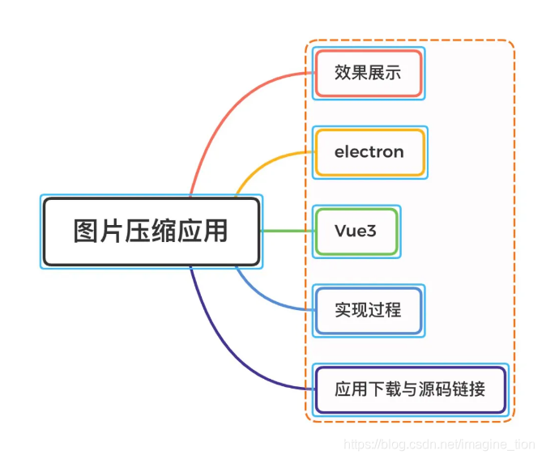

<!-- truncate -->

### 一、效果展示

#### 1.图片压缩

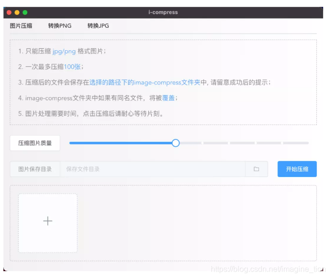


#### 2.转换成PNG
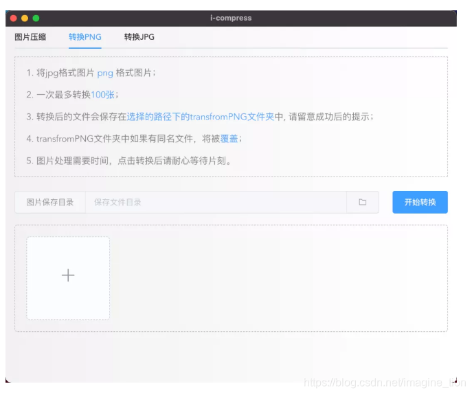


#### 3.转换成JPG

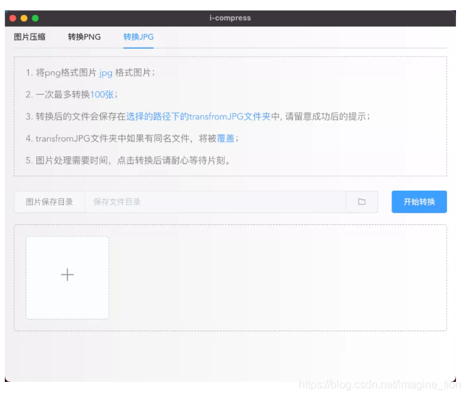


### 二、Electron

electron可以使用 JavaScript，HTML 和 CSS 构建跨平台的桌面应用程序，我们熟悉的Visual Studio Code也是通常electron构建的

electron 核心分为 主进程和渲染进程：

- 渲染进程负责页面展示
- 主进程负责与系统交互

对于图片压缩功能的实现，用户在页面批量选择图片，发送图片路径给主进程，主进程压缩图片并将图片保存在指定目录，将压缩成功或者失败的状态返回给渲染进程，页面提示成功或失败：

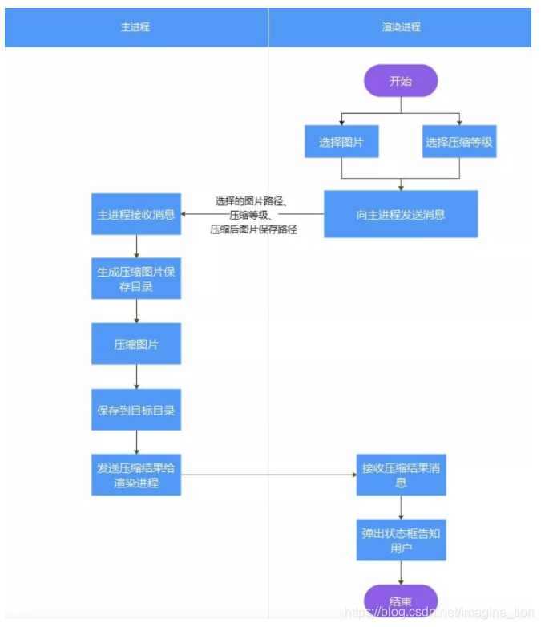


### 三、Vue3

渐进式 JavaScript 框架

### 四、实现教程

#### 1.创建项目（已安装node.js与VueCLI）

```js
vue create <项目名称>
```

- 选择手动配置

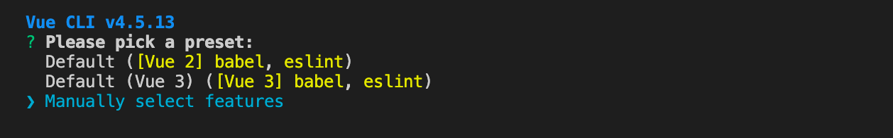


- 通过空格键选择以下绿色选项

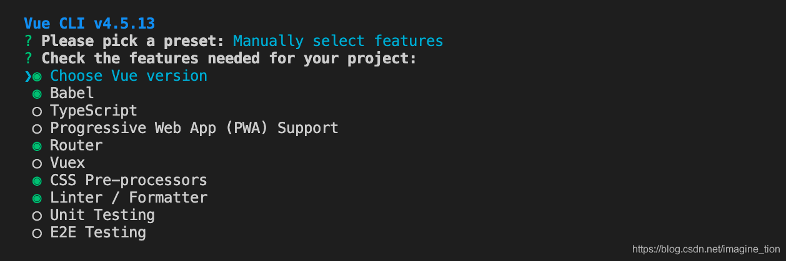


- 选择Vue3

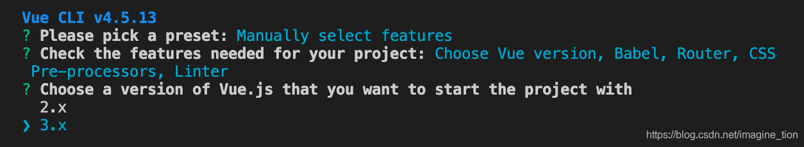


- vue-router的模式选择

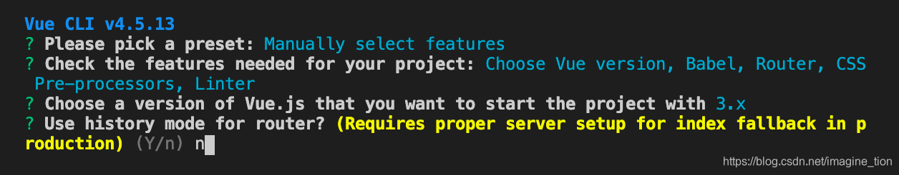


- css预处理器选择

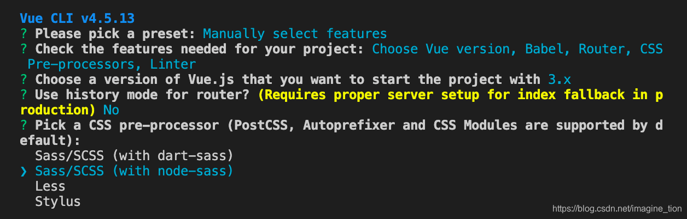


- 代码规范设置

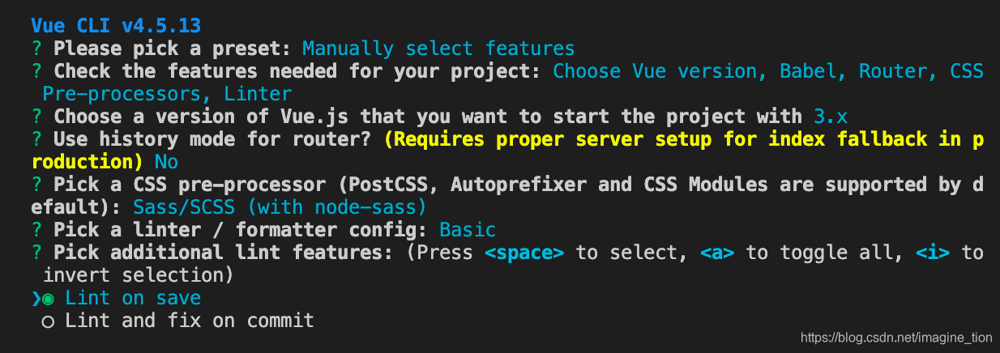


- 配置文件

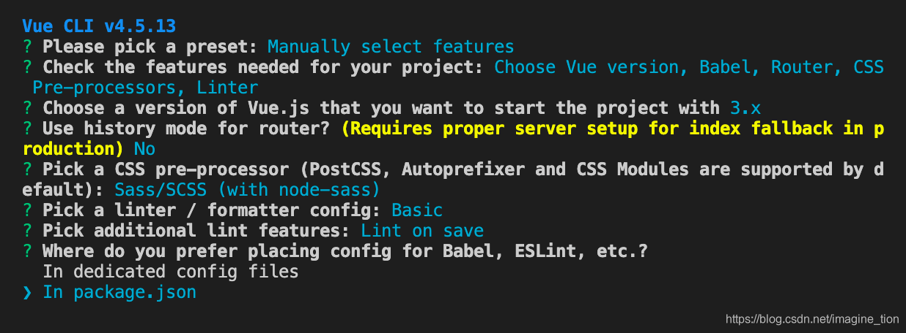


- 是否保存这样的配置作为预设配置：no

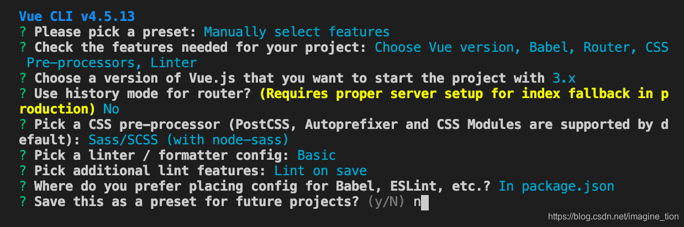


- 等待项目创建完成

#### 2.安装依赖

- 安装 vue-cli-plugin-electron-builder

```js
cd <项目目录>
vue add electron-builder
```

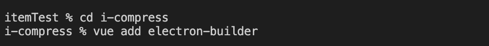


- npm install element-plus --save

- 初始项目目录

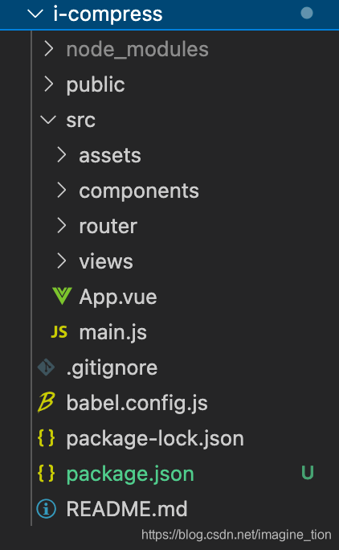


- 运行项目

```js
npm run electron:serve
```

- 项目目录整理

  初始化的项目中已经有一些页面了，但是我们并不需要，下面我们精简下项目目录：

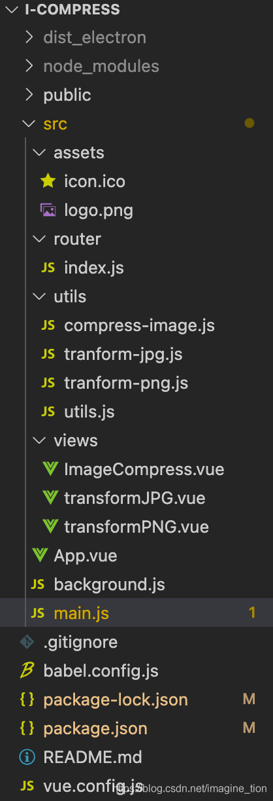


#### 3.主进程

在main.js 中引入element-plus

```js
// main.js
import { createApp } from 'vue'
import App from './App.vue'
import router from './router'
import ElementPlus from 'element-plus';
import 'element-plus/lib/theme-chalk/index.css';

createApp(App).use(router).use(ElementPlus).mount('#app')
```

编写路由：router/index.js

```js
// router/index.js
import { createRouter, createWebHashHistory } from 'vue-router'
import ImageCompress from '../views/ImageCompress.vue'
import transformPNG from '../views/transformPNG.vue'
import transformJPG from '../views/transformJPG.vue'

const routes = [
  {
    path: '/',
    name: 'index',
    redirect: '/first'
  },
  {
    path: '/first',
    name: 'ImageCompress',
    component: ImageCompress
  },
  {
    path: '/second',
    name: 'transformPNG',
    component: transformPNG
  },
  {
    path: '/third',
    name: 'transformJPG',
    component: transformJPG
  },
]

const router = createRouter({
  history: createWebHashHistory(),
  routes
})

export default router
```

编写background.js，electron 中ipcmain(主进程)、ipcrenderer（渲染进程）负责主进程和渲染进程之间的通信

```js
'use strict'

import { app, protocol, BrowserWindow, ipcMain, Menu } from 'electron'
import { createProtocol } from 'vue-cli-plugin-electron-builder/lib'
import installExtension, { VUEJS_DEVTOOLS } from 'electron-devtools-installer'
import imageCompress from './utils/compress-image'
import transformPNG from './utils/tranform-png'
import transformJPG from './utils/tranform-jpg'
const isDevelopment = process.env.NODE_ENV !== 'production'

// Scheme must be registered before the app is ready
protocol.registerSchemesAsPrivileged([
  { scheme: 'app', privileges: { secure: true, standard: true } }
])

let BrowerWindow = null

async function createWindow() {
  // Create the browser window.
  Menu.setApplicationMenu(null) // 隐藏窗口菜单项
  BrowerWindow = new BrowserWindow({
    width: 800,
    height: 660,
    webPreferences: {
      nodeIntegration: true,// 允许页面集成node模块
      contextIsolation: false,
      webSecurity: false,// 取消跨域限制
    }
  })

  if (process.env.WEBPACK_DEV_SERVER_URL) {
    // Load the url of the dev server if in development mode
    await BrowerWindow.loadURL(process.env.WEBPACK_DEV_SERVER_URL)
    if (!process.env.IS_TEST) BrowerWindow.webContents.openDevTools()
  } else {
    createProtocol('app')
    // Load the index.html when not in development
    BrowerWindow.loadURL('app://./index.html')
  }
}

// Quit when all windows are closed.
app.on('window-all-closed', () => {
  // On macOS it is common for applications and their menu bar
  // to stay active until the user quits explicitly with Cmd + Q
  if (process.platform !== 'darwin') {
    app.quit()
  }
})

app.on('activate', () => {
  // On macOS it's common to re-create a window in the app when the
  // dock icon is clicked and there are no other windows open.
  if (BrowserWindow.getAllWindows().length === 0) createWindow()
})

// This method will be called when Electron has finished
// initialization and is ready to create browser windows.
// Some APIs can only be used after this event occurs.
app.on('ready', async () => {
  if (isDevelopment && !process.env.IS_TEST) {
    // Install Vue Devtools
    try {
      await installExtension(VUEJS_DEVTOOLS)
    } catch (e) {
      console.error('Vue Devtools failed to install:', e.toString())
    }
  }
  createWindow()
})

// Exit cleanly on request from parent process in development mode.
if (isDevelopment) {
  if (process.platform === 'win32') {
    process.on('message', (data) => {
      if (data === 'graceful-exit') {
        app.quit()
      }
    })
  } else {
    process.on('SIGTERM', () => {
      app.quit()
    })
  }
}

// 图片压缩：接收 页面发来的消息，arg 为消息参数
ipcMain.on('compress-image', async (event, arg) => { 
  const status = await imageCompress(arg)
  console.log('compress-status')
  BrowerWindow.webContents.send('compress-status', status)
})

// 图片转成png：接收 页面发来的消息，arg 为消息参数
ipcMain.on('transform-png', async (event, arg) => { 
  const status = await transformPNG(arg)
  console.log('png-status')
  BrowerWindow.webContents.send('png-status', status)
})

// 图片转成jpg：接收 页面发来的消息，arg 为消息参数
ipcMain.on('transform-jpg', async (event, arg) => { 
  const status = await transformJPG(arg)
  console.log('jpg-status')
  BrowerWindow.webContents.send('jpg-status', status)
})
```

编写utils/utils.js，该方法用于创建文件存放目录

```js
import fs from 'fs'

// 创建目录，返回创建目录的结果
const mkdir = (path) => {
    return new Promise((resolve, reject) => {
        if (fs.existsSync( path )) { 
            resolve(true)
            return
        }
        fs.mkdir(path, (error) => {
            if (error) {
                reject(false)
            } else {
                resolve(true)
            }
        })
    })
}
export {
    mkdir,
}
```

编写utils/compress-image.js，该方法用于图片压缩

```js
import { nativeImage } from 'electron'
import path from 'path'
import fs from 'fs'
import { mkdir } from './utils'

const imageCompress = (input, quality) => {
    quality = quality || 50
    const image = nativeImage.createFromPath(input);
    const res = image.resize({
        // 图片压缩质量，可选值：better || good || best
        quality: 'best'  
    })
    console.log(res)
    // const imageData = res.toPNG()
    // jpg 压缩 图片质量设置
    const imageData = res.toJPEG(quality)
    return imageData;
}

export default async (options) => {
    // 创建保存图片目录，失败的话退出
    const createDir = await mkdir(options.targetDir)
    if (!createDir) return {
        success: false,
        msg: '创建图片保存目录失败！'
    } 

    try {
        options.fileList.map((item) => {
            const dirParse = path.parse(item)
            const data = imageCompress(item, options.quality)
            const targetDir = `${options.targetDir}${path.sep}${dirParse.name}${dirParse.ext}`
            fs.writeFileSync(targetDir,data)
        })
        return {
            success: true,
            msg: `图片压缩成功，保存在 ${options.targetDir} 目录中`
        }
    } catch (err) {
        console.log(err, 'err')
        return {
            success: false,
            msg: `图片压缩失败!`,
            reason: err
        }
    }
}
```

编写utils/tranform-jpg.js，该方法用于将图片转换成jpg格式

```js
import { nativeImage } from 'electron'
import path from 'path'
import fs from 'fs'
import { mkdir } from './utils'

const imageCompress = (input, quality) => {
    quality = quality || 50
    const image = nativeImage.createFromPath(input);
    const imageData = image.toJPEG(quality)
    return imageData;
}

export default async (options) => {
    // 创建保存图片目录，失败的话退出
    const createDir = await mkdir(options.targetDir)
    if (!createDir) return {
        success: false,
        msg: '创建图片保存目录失败！'
    } 

    try {
        options.fileList.map((item) => {
            const dirParse = path.parse(item)
            const data = imageCompress(item, options.quality)
            const targetDir = `${options.targetDir}${path.sep}${dirParse.name}.jpg`
            fs.writeFileSync(targetDir,data)
        })
        return {
            success: true,
            msg: `图片转换成功，保存在 ${options.targetDir} 目录中`
        }
    } catch (err) {
        console.log(err, 'err')
        return {
            success: false,
            msg: `图片转换失败!`,
            reason: err
        }
    }
}
```

编写utils/tranform-png.js，该方法用于将图片转换成png格式

```js
import { nativeImage } from 'electron'
import path from 'path'
import fs from 'fs'
import { mkdir } from './utils'

const transformPNG = (input, quality) => {
    quality = quality || 50
    const image = nativeImage.createFromPath(input);
    const imageData = image.toPNG()
    return imageData;
}

export default async (options) => {
    // 创建保存图片目录，失败的话退出
    const createDir = await mkdir(options.targetDir)
    if (!createDir) return {
        success: false,
        msg: '创建图片保存目录失败！'
    } 

    try {
        options.fileList.map((item) => {
            const dirParse = path.parse(item)
            const data = transformPNG(item, options.quality)
            const targetDir = `${options.targetDir}${path.sep}${dirParse.name}.png`
            fs.writeFileSync(targetDir,data)
        })
        return {
            success: true,
            msg: `图片转换成功，保存在 ${options.targetDir} 目录中`
        }
    } catch (err) {
        console.log(err, 'err')
        return {
            success: false,
            msg: `图片转换失败!`,
            reason: err
        }
    }
}
```

#### 4.渲染进程

现在我们来写应用界面和逻辑，app.vue文件如下

```html
<template>
  <el-tabs v-model="activeName" @tab-click="handleClick" class="tabs">
    <el-tab-pane label="图片压缩" name="first"></el-tab-pane>
    <el-tab-pane label="转换PNG" name="second"></el-tab-pane>
    <el-tab-pane label="转换JPG" name="third"></el-tab-pane>
  </el-tabs>
  <router-view/>
</template>

<style lang="scss">
body{
  margin: 0;
  padding: 0;
  background: linear-gradient(to right, #f1f1f1, #ffffff);
}
#app {
  font-family: Avenir, Helvetica, Arial, sans-serif;
  -webkit-font-smoothing: antialiased;
  -moz-osx-font-smoothing: grayscale;
  // text-align: center;
  color: #868585;
  .tabs{
    width: 96%;
    margin: 0 auto;
  }
}
</style>

<script>
import { ref } from 'vue'
import { useRouter } from "vue-router";
export default {
  setup(){
    const activeName = ref(null);
    const router = useRouter();
    const handleClick = () =>{
      let path = '/'+activeName.value
      router.push(path)
    }
    return {
      activeName,
      handleClick
    }
  }
}
</script>
```

在imageCompress.vue中，界面组件使用element-plus: 压缩质量选择用滑块组件el-slider，图片选择用el-upload组件。

页面逻辑的编写，用户选择文件、压缩质量后，生成一个文件保存目录，并将文件的系统路径保存在数组中，通过ipcRenderer 传递给主进程，交由主进程中去进行图片处理，主进程处理完成（或失败）后，并且在页面响应由主进程返回的处理状态：

- ipcRenderer.send(): 向主进程（ipcMain）发送消息
- ipcRenderer.on(): 响应主进程（ipcMain）推送过来的消息

```html
<template>
  <div class="tinypng-wrapper">
    <div class="tips">
      <p>1. 只能压缩 <span class="highlight">jpg/png</span> 格式图片；</p>
      <p>2. 一次最多压缩<span class="highlight">100张</span>；</p>
      <p>
        3. 压缩后的文件会保存在<span class="highlight"
          >选择的路径下的image-compress文件夹</span
        >中, 请留意成功后的提示；
      </p>
      <p>
        4. image-compress文件夹中如果有同名文件，将被<span class="highlight"
          >覆盖</span
        >；
      </p>
      <p>5. 图片处理需要时间，点击压缩后请耐心等待片刻。</p>
    </div>
    <div class="header">
      <el-button>压缩图片质量</el-button>
      <el-slider
        class="slider"
        v-model="quality"
        :step="10"
        :min="10"
        show-stops
      >
      </el-slider>
    </div>
    <div class="header">
      <input type="file" id="file" @change="fileChange" hidden webkitdirectory>
      <el-input placeholder="保存文件目录" v-model="targetDir" disabled>
        <template #prepend>图片保存目录</template>
        <template #append>
          <el-button icon="el-icon-folder" @click="btnChange"></el-button>
        </template>
      </el-input>
      <el-button style="margin-left: 24px" type="primary" @click="handleSubmit"
        >开始压缩</el-button
      >
    </div>
    <div class="tinypng-content">
      <el-upload
        class="upload-demo"
        ref="upload"
        accept=".jpg,.png"
        multiple
        :auto-upload="false"
        :limit="maxFileNum"
        :file-list="fileList"
        :on-exceed="handleExceed"
        :on-preview="handlePictureCardPreview"
        action=""
        list-type="picture-card"
      >
        <i class="el-icon-plus"></i>
      </el-upload>
      <el-dialog v-model="dialogVisible">
        
      </el-dialog>
    </div>
  </div>
</template>

<style lang="scss" scoped>
.tinypng-wrapper{
  width: 96%;
  margin: 0 auto;
  .tips{
    padding-left: 20px;
    border: 1px dashed rgb(187, 187, 187);
    .highlight{
      color: rgb(84, 162, 252);
    }
  }
  .header{
    display: flex;
    align-items:center;
    justify-content: space-between;
    margin-top: 25px;
    .slider{
      width: 78%;
      margin-right: 20px;
    }
  }
  .tinypng-content{
    margin: 20px 0;
    padding: 20px;
    border: 1px dashed rgb(187, 187, 187);
    border-radius: 5px;
  }
}
</style>

<script>
// electron ipcRenderer -- 与electron主进程通信
const { ipcRenderer } = window.require("electron")
// path模块，处理文件路径
const PATH = window.require("path");

import { onMounted, ref, onBeforeUnmount } from "vue";
import { ElMessage, ElNotification, ElLoading } from "element-plus";
// loading 实例
 let loadingInstance = null;

export default {
  setup() {
    // 文件列表
    const fileList = ref([]);
    // 批量处理文件数量限制
    const maxFileNum = ref(100);
    // 图片选择组件
    const upload = ref(null);
    // 图片保存的目标目录
    const targetDir = ref(null);
    // 图片压缩质量
    const quality = ref(50);
    // 弹窗显示控制
    const dialogVisible = ref(false);
    // 弹窗图片链接
    const dialogImageUrl = ref(null);
    // 图片压缩质量选项
    const marks = ref({
      10: "10",
      20: "20",
      30: "30",
      40: "40",
      50: "50",
      60: "60",
      70: "70",
      80: "80",
      90: "90",
      100: "100"
    });

    // 文件选择数量超出设定值时，弹出警告框
    const handleExceed = (files, fileList) => {
        ElMessage.warning({
            message: `最多只能选择 ${ maxFileNum.value }个文件哦，当前选择了 ${files.length + fileList.length} 个文件`,
            type: "warning"
        });
      
    };

    // 确认按钮，开始压缩
    const handleSubmit = () => {
      const uploadFiles = upload.value.uploadFiles;
      // 验证是否选择了图片，没有选择弹出警告信息
       if (!uploadFiles.length) {
        ElNotification({
          title: "警告",
          message: "请先选择文件！", 
          type: "warning"
        });
        return false;
      }
      // 验证是否选择了路径，没有选择弹出警告信息
       if (!targetDir.value) {
        ElNotification({
          title: "警告",
          message: "请先选择文件存放路径！", 
          type: "warning"
        });
        return false;
      }
	
      const dir = PATH.normalize(targetDir.value);

      // 遍历出图片文件的路径
      const fileList = [];
      uploadFiles.map(item => item?.raw?.path && fileList.push(item.raw.path));
      
      // 消息参数
      const data = {
        fileList,
        quality: quality.value,
        targetDir: dir
      };
      
      // 显示loading
      loadingInstance = ElLoading.service( {
        background: "rgba(255,255,255,0.5)"
      });
        
     // 向主进程发送消息，消息中有：压缩质量、压缩保存目录、压缩文件的地址（数组）
     ipcRenderer.send("compress-image", data);
    };

    // 选择文档路径
    const btnChange = () => {
      var file = document.getElementById('file')
      file.click()
    };

    // 文件路径改变时
    const fileChange = () => {
      try {
        const fu = document.getElementById('file')
        if (fu == null) return
        targetDir.value = PATH.parse(fu.files[0].path).dir+ `${PATH.sep}image-compress`
        console.log(targetDir.value)
      } catch (error) {
        console.debug('choice file err:', error)
      }
    };

    const handlePictureCardPreview = file => {
      console.log('file.url',file.url)
      ElNotification({
        title: "通知",
        message: "预览图片功能暂不支持"
      });
    }

    onBeforeUnmount(() => {
      loadingInstance = null;
    });

    // mounted 生命周期
    onMounted(() => {
    // 响应主进程推送的图片压缩状态，并弹框显示
          ipcRenderer.on("compress-status", (event, arg) => {
        ElNotification({
            title: arg.success ? "成功" : "失败",
            message: arg.success ? arg.msg : arg.reason,
            type: arg.success ? "success" : "error"
        });
        loadingInstance.close();
        if (arg.success) {
          upload.value.uploadFiles = [];
          fileList.value = [];
          quality.value = 50;
          // targetDir.value = null;
        }

    });
    });

    return {
      targetDir,
      upload,
      quality,
      marks,
      fileList,
      maxFileNum,
      handleExceed,
      handleSubmit,
      btnChange,
      fileChange,
      handlePictureCardPreview,
      dialogVisible,
      dialogImageUrl
    };
  }
};
</script>
```

transfromJPG.vue：略

transfromPNG.vue：略

#### 5.项目配置

应用打包后，安装程序和图标配置：在项目根目录下创建vue.config.js文件（目前为windows下的应用打包配置）

```js
module.exports = {
  pluginOptions: {
    electronBuilder: {
      builderOptions: {
        "appId": "com.example.app",
        "productName": "i-compress",//项目名，也是生成的安装文件名，即aDemo.exe
        "copyright": "Copyright © 2021",//版权信息
        "directories": {
          "output": "build"//输出文件路径
        },
        "win": {//win相关配置
          "icon": "./src/assets/icon.ico",//图标，当前图标在根目录下，注意这里有两个坑
          "target": [
            {
              "target": "nsis",//利用nsis制作安装程序
              "arch": [
                "x64",//64位
              ]
            }
          ]
        },
        "nsis": {
          "oneClick": false, // 是否一键安装
          "allowElevation": true, // 允许请求提升。 如果为false，则用户必须使用提升的权限重新启动安装程序。
          "allowToChangeInstallationDirectory": true, // 允许修改安装目录
          "installerIcon": "./src/assets/icon.ico",// 安装图标
          "uninstallerIcon": "./src/assets/icon.ico",//卸载图标
          "installerHeaderIcon": "./src/assets/icon.ico", // 安装时头部图标
          "createDesktopShortcut": true, // 创建桌面图标
          "createStartMenuShortcut": true,// 创建开始菜单图标
          "shortcutName": "Icompress", // 桌面显示应用名称
        },
      }
    },
  },
}
```

#### 6.应用打包

```js
npm run electron:build
```

运行上面命令行后，会在项目根目录下生成build文件夹，内容如下（贪图方便，应用图标笔者借用xmind的图标作为应用图标）

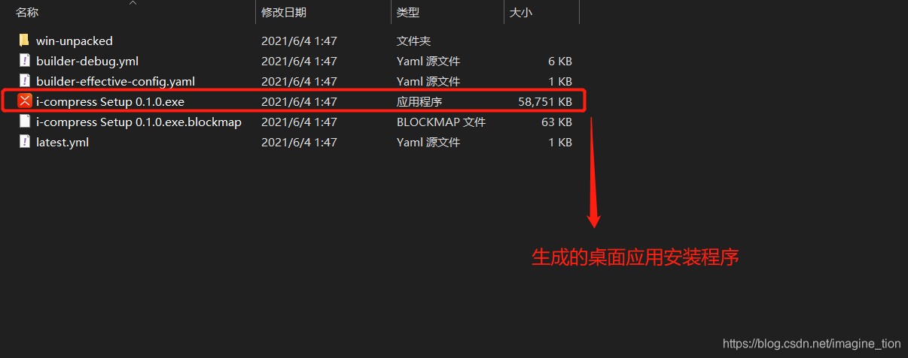


安装后，应用桌面效果

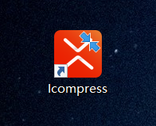


### 五、应用下载与源码链接

应用下载链接：链接：https://pan.baidu.com/s/1iWFFo0GSPPYpdR87DZdMtQ  提取码：kjhx

项目源码链接：https://github.com/innagine/i-compress （希望可以给个star）
