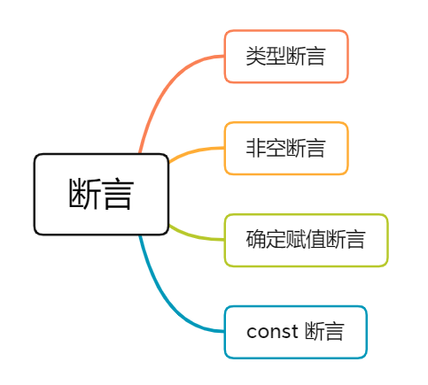

#### 1. 类型断言

有时候你会遇到这样的情况，你会比 TypeScript 更了解某个值的详细信息。通常这会发生在你清楚地知道一个实体具有比它现有类型更确切的类型。

类型断言有两种形式：

- ##### “尖括号” 语法

```typescript
let someValue: any = "前端收割机";
let strLength: number = (<string>someValue).length;
```

- ##### as 语法

```typescript
let someValue: any = "前端收割机";
let strLength: number = (someValue as string).length;
```

注意：在TS类型断言中，关于关键字 **`as`** 与 **`<>`** 两种方式，如果你在使用过 JSX，那么我推荐你使用 **`as`**，后者会与 JSX 语法有所混淆。

#### 2. 非空断言

在上下文中当类型检查器无法断定类型时，一个新的后缀表达式操作符 `!` 可以用于断言操作对象是非 null 和非 undefined 类型。**具体而言，x! 将从 x 值域中排除 null 和 undefined 。**

作用：

- ##### 忽略 undefined 和 null 类型

```typescript
function myFunc(maybeString: string | undefined | null) {
  // Type 'string | null | undefined' is not assignable to type 'string'.
  // Type 'undefined' is not assignable to type 'string'. 
  const onlyString: string = maybeString; // Error
  const ignoreUndefinedAndNull: string = maybeString!; // Ok
}
```

- ##### 调用函数时忽略 undefined 类型

```typescript
type NumGenerator = () => number;

function myFunc(numGenerator: NumGenerator | undefined) {
  // Object is possibly 'undefined'.(2532)
  // Cannot invoke an object which is possibly 'undefined'.(2722)
  const num1 = numGenerator(); // Error
  const num2 = numGenerator!(); //OK
}
```

因为 `!` 非空断言操作符会从编译生成的 JavaScript 代码中移除，所以在实际使用的过程中，要特别注意。比如下面这个例子：

```typescript
const a: number | undefined = undefined;
const b: number = a!;
console.log(b); 
```

以上 TS 代码会编译生成以下 ES5 代码：

```javascript
"use strict";
const a = undefined;
const b = a;
console.log(b);
```

虽然在 TS 代码中，我们使用了非空断言，使得 `const b: number = a!;` 语句可以通过 TypeScript 类型检查器的检查。但在生成的 ES5 代码中，`!` 非空断言操作符被移除了，所以在浏览器中执行以上代码，在控制台会输出 `undefined`。

#### 3. 确定赋值断言

在 TypeScript 2.7 版本中引入了确定赋值断言，即允许在实例属性和变量声明后面放置一个 `!` 号，从而告诉 TypeScript 该属性会被明确地赋值。为了更好地理解它的作用，我们来看个具体的例子：

```typescript
let x: number;
initialize();
// Variable 'x' is used before being assigned.(2454)
console.log(2 * x); // Error

function initialize() {
  x = 10;
}
```

很明显该异常信息是说变量 x 在赋值前被使用了，要解决该问题，我们可以使用确定赋值断言：

```typescript
let x!: number;
initialize();
console.log(2 * x); // Ok

function initialize() {
  x = 10;
}
```

通过 `let x!: number;` 确定赋值断言，TypeScript 编译器就会知道该属性会被明确地赋值。

#### 4.const断言

TypeScript 3.4 为文字值引入了一种称为*`const`*断言的新构造。它的语法是一个类型断言，`const`代替类型名称（例如`123 as const`）。当我们用`const`断言构造新的文字表达式时，我们可以向语言发出信号：

- 该表达式中的任何文字类型都不应该被扩展（例如，不应该从`"hello"`to 开始`string`）
- 对象字面量获取`readonly`属性
- 数组文字变成`readonly`元组

```typescript
// Type '"hello"'
let x = "hello" as const;
// Type 'readonly [10, 20]'
let y = [10, 20] as const;
// Type '{ readonly text: "hello" }'
let z = { text: "hello" } as const;
```

`as const` 中的 const 与我们声明常量时使用的 `const`区别：

- `const` 常量声明是 ES6 的语法，对 TS 而言，它只能反映该常量本身是不可被重新赋值的，它的子属性仍然可以被修改，故 TS 只会对它们做松散的类型推断
- `as const` 是 TS 的语法，它告诉 TS 它所断言的值以及该值的所有层级的子属性都是不可篡改的，故对每一级子属性都会做最严格的类型推断

从个人角度出发，`as const` 写作 `as readonly` 或 `as final` 更能准确反映它的语义和行为。
