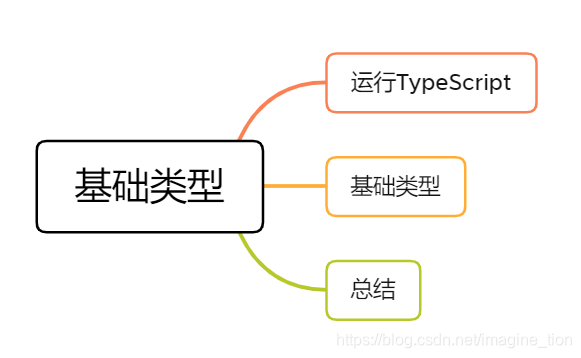
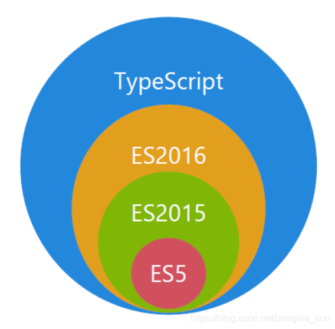
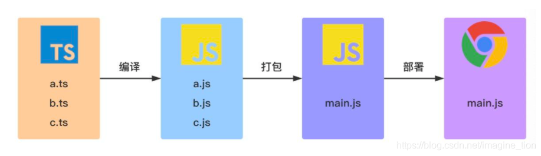

本期系列推文将会推进TypeScript的学习，其实我们不难看出TypeScript是JavaScript的超集，也就是说：typescript是对于JavaScript的扩展，为JavaScript添加了类型系统。




优势：

- 类型化思维方式，使得开发更加严谨，提前发现错误，减少改Bug时间
- 类型系统提高了代码的可读性，并使维护和重构代码更加容易
- 补充了接口（interface）、枚举（Enum）、元组（Tuple）等开发大型应用时JavaScript缺失的功能

### 一、运行TypeScript

- 安装(全局安装)

```shell
$ npm install -g typescript
```

- 验证

```shell
$ tsc -v 
# Version 4.0.2
```

- 编译

```shell
$ tsc helloworld.ts
# helloworld.ts => helloworld.js
```

- 流程




- 注意：
  1. typescript**不能**直接在浏览器或`node.js`中执行；
  2. ts文件要经过编译成js文件之后才能在浏览器或`node.js`中执行，执行 `tsc helloworld.ts` 命令，之后会生成一个编译好的文件 `helloworld.js`，运行`node helloworld.js`命令，代码才能执行起来。
  3. 可以通过ts-node命令，简化执行ts代码，例如`ts-node helloworld.ts`
  4. TypeScript 只会在编译阶段对类型进行静态检查，如果发现有错误，编译时就会报错。而在运行时，编译生成的 JS 与普通的 JavaScript 文件一样，并不会进行类型检查。

### 二、typescript基础类型

#### 1.Number 类型

```typescript
let count: number = 777;
// ES5：var count = 777;
```

#### 2.String 类型

```typescript
let name: string = "前端收割机";
// ES5：var name = '前端收割机';
```

#### 3.Boolean 类型

```typescript
let isDone: boolean = false;
// ES5：var isDone = false;
```

#### 4.Null 和 Undefined 类型

TypeScript 里，`undefined` 和 `null` 两者有各自的类型分别为 `undefined` 和 `null`

```typescript
let u: undefined = undefined;
let n: null = null;

```

#### 5.object 类型

`Object 类型`：它是所有 `Object` 类的实例的类型，它由以下两个接口来定义：

- `Object` 接口定义了 `Object.prototype` 原型对象上的属性

```typescript
// node_modules/typescript/lib/lib.es5.d.ts
interface Object {
  constructor: Function
  toString(): string
  toLocaleString(): string
  valueOf(): Object
  hasOwnProperty(v: PropertyKey): boolean
  isPrototypeOf(v: Object): boolean
  propertyIsEnumerable(v: PropertyKey): boolean
}
```

- `ObjectConstructor` 接口定义了 `Object` 类的属性

```typescript
// node_modules/typescript/lib/lib.es5.d.ts
interface ObjectConstructor {
  /** Invocation via `new` */
  new (value?: any): Object
  /** Invocation via function calls */
  (value?: any): any
  readonly prototype: Object
  getPrototypeOf(o: any): any
  // ···
}
```

#### 6.Array 类型

TypeScript 里，数组类型有两种表达形式：

- 直接表示：`type[]`

```typescript
let array: number[] = [1, 2, 3]
// ES5：var array = [1,2,3];
```

- 用泛型的方式表示：`Array<type>`

```typescript
let array: Array<number> = [1, 2, 3] // Array<number>泛型语法
// ES5：var array = [1,2,3];
```

#### 7.Enum 类型

- **数字枚举**

```typescript
enum Direction {
  NORTH,
  SOUTH,
  EAST,
  WEST,
}

let dir: Direction = Direction.NORTH;
```

默认情况下，NORTH 的初始值为 0，其余的成员会从 1 开始自动增长。换句话说，Direction.SOUTH 的值为 1，Direction.EAST 的值为 2，Direction.WEST 的值为 3。

编译后，对应的 ES5 代码如下：

```typescript
"use strict";
var Direction;
(function (Direction) {
  Direction[(Direction["NORTH"] = 0)] = "NORTH";
  Direction[(Direction["SOUTH"] = 1)] = "SOUTH";
  Direction[(Direction["EAST"] = 2)] = "EAST";
  Direction[(Direction["WEST"] = 3)] = "WEST";
})(Direction || (Direction = {}));
var dir = Direction.NORTH;
```

通过观察数字枚举的编译结果，可以知道数字枚举除了支持 **从成员名称到成员值** 的普通映射之外，它还支持 **从成员值到成员名称** 的**反向映射**：

```typescript
let dirName = Direction[0]; // NORTH
let dirVal = Direction["NORTH"]; // 0
```

除此之外，可以设置 NORTH 的初始值，比如：

```typescript
enum Direction {
  NORTH = 3,
  SOUTH, //4
  EAST, //5
  WEST, //6
}
```

注意：数字枚举如果没有显式设置值时，则会使用默认规则进行初始化（从0开始递增）。

- **字符串枚举**

在一个字符串枚举里，每个成员都必须用字符串字面量，或另外一个字符串枚举成员进行初始化。

```typescript
enum Direction {
  NORTH = "NORTH",
  SOUTH = "SOUTH",
  EAST = "EAST",
  WEST = "WEST",
}
```

注意：对于纯字符串枚举，我们不能省略任何初始化程序。

- **常量枚举**

使用 `const` 关键字修饰的枚举，常量枚举会使用内联语法，不会为枚举类型编译生成任何 JavaScript。

```typescript
const enum Direction {
  NORTH,
  SOUTH,
  EAST,
  WEST,
}

let dir: Direction = Direction.NORTH;
```

对应的 ES5 代码如下：

```javascript
"use strict";
var dir = 0 /* NORTH */;
```

- **异构枚举**

异构枚举的成员值是数字和字符串的混合：

```typescript
enum Enum {
  A,
  B,
  C = "C",
  D = "D",
  E = 8,
  F,
}
```

对应的 ES5 代码如下：

```typescript
"use strict";
var Enum;
(function (Enum) {
    Enum[Enum["A"] = 0] = "A";
    Enum[Enum["B"] = 1] = "B";
    Enum["C"] = "C";
    Enum["D"] = "D";
    Enum[Enum["E"] = 8] = "E";
    Enum[Enum["F"] = 9] = "F";
})(Enum || (Enum = {}));
```

- **注意：**
  1. 每个枚举成员都带有一个值，它可以是 *常量*或 *计算出来的*。
  2. 枚举是在运行时真正存在的对象。
  3. 数字枚举成员具有了 反向映射，从枚举值到枚举名字。
  4. 常量枚举只能使用常量枚举表达式，并且不同于常规的枚举，它们在编译阶段会被删除。

#### 8.Tuple 类型

数组一般由同种类型的值组成，但有时我们需要在单个变量中存储不同类型的值，这时候我们就可以使用元组。在 JavaScript 中是没有元组的，元组是 TypeScript 中特有的类型，其工作方式类似于数组。

元组可用于定义具有**有限**数量的未命名属性的类型。每个属性都有一个关联的类型。使用元组时，必须提供**每个属性的值**。

```typescript
let tupleType: [string, boolean];
tupleType = ["前端收割机", true];
```

在上面代码中，我们定义了一个名为 `tupleType` 的变量，它的类型是一个类型数组 `[string, boolean]`，然后我们按照正确的类型依次初始化 tupleType 变量。与数组一样，我们可以通过下标来访问元组中的元素：

```typescript
console.log(tupleType[0]); // 前端收割机
console.log(tupleType[1]); // true
```

在元组初始化的时候，如果出现类型不匹配的话，比如：

```typescript
tupleType = [true, "前端收割机"];
```

此时，TypeScript 编译器会提示以下错误信息：

```
[0]: Type 'true' is not assignable to type 'string'.
[1]: Type 'string' is not assignable to type 'boolean'.
```

很明显是因为类型不匹配导致的。在元组初始化的时候，我们还必须提供每个属性的值，不然也会出现错误，比如：

```typescript
tupleType = ["前端收割机"];
```

此时，TypeScript 编译器会提示以下错误信息：

```typescript
Property '1' is missing in type '[string]' but required in type '[string, boolean]'.
```

#### 9.Any 类型

在 TypeScript 中，任何类型都可以被归为 any 类型。这让 any 类型成为了类型系统的顶级类型（也被称作全局超级类型）。

```typescript
let notSure: any = 7;
notSure = "前端收割机";
notSure = true;
notSure = null;
notSure = undefined
```

`any` 类型本质上是类型系统的一个逃逸舱。作为开发者，这给了我们很大的自由：TypeScript 允许我们对 `any` 类型的值执行任何操作，而无需事先执行任何形式的检查。比如：

```typescript
let value: any;

value.foo.bar; // OK
value.trim(); // OK
value(); // OK
new value(); // OK
value[0][1]; // OK
```

有时候，我们会想要为那些在编程阶段还不清楚类型的变量指定一个类型。 这些值可能来自于动态的内容，比如来自用户输入或第三方代码库。 这种情况下，我们不希望类型检查器对这些值进行检查而是直接让它们通过编译阶段的检查。 那么我们可以使用 `any`类型来标记这些变量。

#### 10.Unknown 类型

使用 `any` 类型，可以很容易地编写类型正确但在运行时有问题的代码。如果我们使用 `any` 类型，就无法使用 TypeScript 提供的大量的保护机制。为了解决 `any` 带来的问题，TypeScript 3.0 引入了 `unknown` 类型。

就像所有类型都可以赋值给 `any`，所有类型也都可以赋值给 `unknown`。这使得 `unknown` 成为 TypeScript 类型系统的另一种顶级类型（另一种是 `any`）。下面我们来看一下 `unknown` 类型的使用示例：

```typescript
let value: unknown;

value = true; // OK
value = 42; // OK
value = "Hello World"; // OK
value = []; // OK
value = {}; // OK
value = Math.random; // OK
value = null; // OK
value = undefined; // OK
value = new TypeError(); // OK
value = Symbol("type"); // OK
```

对 `value` 变量的所有赋值都被认为是类型正确的。但是，当我们尝试将类型为 `unknown` 的值赋值给其他类型的变量时会发生什么？

```typescript
let value: unknown;

let value1: unknown = value; // OK
let value2: any = value; // OK
let value3: boolean = value; // Error
let value4: number = value; // Error
let value5: string = value; // Error
let value6: object = value; // Error
let value7: any[] = value; // Error
let value8: Function = value; // Error
```

`unknown` 类型只能被赋值给 `any` 类型和 `unknown` 类型本身。直观地说，这是有道理的：只有能够保存任意类型值的容器才能保存 `unknown` 类型的值。毕竟我们不知道变量 `value` 中存储了什么类型的值。

现在让我们看看当我们尝试对类型为 `unknown` 的值执行操作时会发生什么。以下是我们在之前 `any` 章节看过的相同操作：

```typescript
let value: unknown;

value.foo.bar; // Error
value.trim(); // Error
value(); // Error
new value(); // Error
value[0][1]; // Error
```

将 `value` 变量类型设置为 `unknown` 后，这些操作都不再被认为是类型正确的。通过将 `any` 类型改变为 `unknown` 类型，我们已将允许所有更改的默认设置，更改为禁止任何更改。

总结：`any`类型和`unknown`类型的异同：

| 类型                   | any                | unknown                                |
| ---------------------- | ------------------ | -------------------------------------- |
| 被赋值                 | 可以被赋予任意值   | 可以被赋予任意值                       |
| 赋值                   | 可以赋值给任意变量 | 只能赋值给 `any` 和 `unknown` 类型变量 |
| 所有允许更改的默认设置 | 可以更改           | 禁止更改                               |

#### 11.Void 类型

某种程度上来说，`void` 类型像是与 `any` 类型相反，它表示没有任何类型。当一个函数没有返回值时，你通常会见到其返回值类型是 `void`：

```ts
function saySomething(): void {
  console.log('前端收割机')
}
```

编译生成的 ES5 代码如下：

```typescript
"use strict";
function saySomething() {
  console.log("前端收割机");
```

需要注意的是，声明一个 `void` 类型的变量没有什么作用，因为在严格模式下，它的值只能为 `undefined：`

```ts
let unusable: void = undefined
```

#### 12.Never 类型

`never` 类型表示的是那些永不存在的值的类型。 例如，`never` 类型是那些总是会抛出异常或根本就不会有返回值的函数表达式或箭头函数表达式的返回值类型。

```ts
// function 永远不会返回
function error(message: string): never {
  throw new Error(message)
}
复制代码
```

又如，基础类型的`交叉类型`返回的也是`never`，应为他们之间永远不存在交集：

```ts
let value = '1' & 1 // never
复制代码
```

在 `TypeScript` 中，可以利用 `never` 类型的特性来实现全面性检查，具体示例如下：

```ts
type Foo = string | number

function controlFlowAnalysisWithNever(foo: Foo) {
  if (typeof foo === 'string') {
    // 这里 foo 被收窄为 string 类型
  } else if (typeof foo === 'number') {
    // 这里 foo 被收窄为 number 类型
  } else {
    // foo 在这里是 never
    const check: never = foo
  }
}
```

注意在 `else` 分支里面，我们把收窄为 `never` 的 `foo` 赋值给一个显示声明的 `never` 变量。如果一切逻辑正确，那么这里应该能够编译通过。但是假如后来有一天你的同事修改了 `Foo` 的类型：

```ts
type Foo = string | number | boolean
```

然而他忘记同时修改 `controlFlowAnalysisWithNever` 方法中的控制流程，这时候 `else` 分支的 `foo` 类型会被收窄为 `boolean` 类型，导致无法赋值给 `never` 类型，这时就会产生一个编译错误。通过这个方式，我们可以确保 `controlFlowAnalysisWithNever` 方法总是穷尽了 `Foo` 的所有可能类型。 通过这个示例，我们可以得出一个结论：使用 `never` 避免出现新增了`联合类型`没有对应的实现，目的就是写出类型绝对安全的代码。

#### 13.Symbol 类型

```ts
const sym = Symbol();
let obj = {
  [sym]: "前端收割机",
};

console.log(obj[sym]); // 前端收割机 
```

### 三、总结

| 基础类型 | JavaScript                                                   | TypeScript                                                   |
| -------- | ------------------------------------------------------------ | ------------------------------------------------------------ |
| 相同     | Boolean 类型、Number 类型、String 类型、Symbol 类型、Null类型、Undefined 类型、Array 类型、object类型 | Boolean 类型、Number 类型、String 类型、Symbol 类型、Null类型、Undefined 类型、Array 类型、object类型 |
| 不同     |                                                              | Enum 类型、Any 类型、Unknown 类型、Tuple 类型、Void 类型、Never 类型 |


