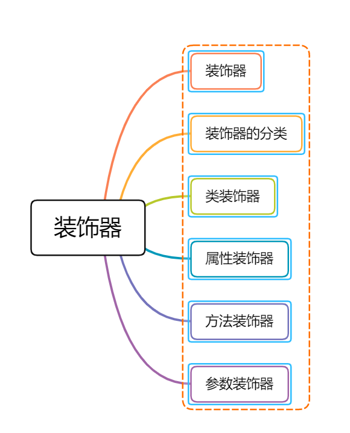

### 一、装饰器

#### 1.概念

装饰器让程序员可以编写元信息以内省代码。装饰器的最佳使用场景是横切关注点——面向切面编程。

面向切面编程（AOP） 是一种编程范式，它允许我们分离[横切关注点](https://link.juejin.cn/?target=https%3A%2F%2Fzh.wikipedia.org%2Fwiki%2F%E6%A8%AA%E5%88%87%E5%85%B3%E6%B3%A8%E7%82%B9)，藉此达到增加模块化程度的目标。它可以在不修改代码自身的前提下，给已有代码增加额外的行为（通知）。

装饰器是一种特殊的声明，可附加在类、方法、访问器、属性、参数声明上。

通俗的讲`装饰器就是一个方法`，可以注入到类、方法、属性参数上来扩展类、属性、方法、参数的功能。

#### 2.相关表现

装饰器使用 `@expression` 的形式，其中 `expression` 必须能够演算为在运行时调用的函数，其中包括装饰声明信息。

它起到了以声明式方法将元信息添加至已有代码的作用。

装饰器类型及其执行优先级为

1. 类装饰器——优先级 4 （对象实例化，静态）
2. 方法装饰器——优先级 2 （对象实例化，静态）
3. 访问器或属性装饰器——优先级 3 （对象实例化，静态）
4. 参数装饰器——优先级 1 （对象实例化，静态）

注意，如果装饰器应用于类构造函数的参数，那么不同装饰器的优先级为：参数装饰器 > 方法装饰器 > 访问器或参数装饰器 > 构造器参数装饰器 >  类装饰器。

### 二、 装饰器的分类

- 类装饰器（Class decorators）
- 属性装饰器（Property decorators）
- 方法装饰器（Method decorators）
- 参数装饰器（Parameter decorators）

需要注意的是，若要启用实验性的装饰器特性，你必须在命令行或 `tsconfig.json` 里启用 `experimentalDecorators` 编译器选项：

**命令行**：

```shell
tsc --target ES5 --experimentalDecorators
```

**tsconfig.json**：

```json
{
  "compilerOptions": {
     "target": "ES5",
     "experimentalDecorators": true
   }
}
```

### 三、类装饰器

类装饰器声明：

```typescript
declare type ClassDecorator = <TFunction extends Function>(
  target: TFunction
) => TFunction | void;
```

类装饰器顾名思义，就是用来装饰类的。它接收一个参数：

- target: TFunction - 被装饰的类

看完第一眼后，是不是感觉都不好了。没事，我们马上来个例子：

```typescript
function Greeter(target: Function): void {
  target.prototype.greet = function (): void {
    console.log("Hello 前端收割机!");
  };
}

@Greeter
class Greeting {
  constructor() {
    // 内部实现
  }
}

let myGreeting = new Greeting();
(myGreeting as any).greet(); // console output: 'Hello 前端收割机!';
```

上面的例子中，我们定义了 `Greeter` 类装饰器，同时我们使用了 `@Greeter` 语法糖，来使用装饰器。

> 友情提示：读者可以直接复制上面的代码，在 [TypeScript Playground](https://link.juejin.cn/?target=https%3A%2F%2Fwww.typescriptlang.org%2Fplay%2Findex.html) 中运行查看结果。

有的读者可能想问，例子中总是输出 `Hello Semlinker!` ，能自定义输出的问候语么 ？这个问题很好，答案是可以的。

具体实现如下：

```typescript
function Greeter(greeting: string) {
  return function (target: Function) {
    target.prototype.greet = function (): void {
      console.log(greeting);
    };
  };
}

@Greeter("Hello TS!")
class Greeting {
  constructor() {
    // 内部实现
  }
}

let myGreeting = new Greeting();
(myGreeting as any).greet(); // console output: 'Hello TS!';
```

### 四、属性装饰器

属性装饰器声明：

```typescript
declare type PropertyDecorator = (target:Object, 
  propertyKey: string | symbol ) => void;
```

属性装饰器顾名思义，用来装饰类的属性。它接收两个参数：

- target: Object - 被装饰的类
- propertyKey: string | symbol - 被装饰类的属性名

趁热打铁，马上来个例子热热身：

```typescript
function logProperty(target: any, key: string) {
  delete target[key];

  const backingField = "_" + key;

  Object.defineProperty(target, backingField, {
    writable: true,
    enumerable: true,
    configurable: true
  });

  // property getter
  const getter = function (this: any) {
    const currVal = this[backingField];
    console.log(`Get: ${key} => ${currVal}`);
    return currVal;
  };

  // property setter
  const setter = function (this: any, newVal: any) {
    console.log(`Set: ${key} => ${newVal}`);
    this[backingField] = newVal;
  };

  // Create new property with getter and setter
  Object.defineProperty(target, key, {
    get: getter,
    set: setter,
    enumerable: true,
    configurable: true
  });
}

class Person { 
  @logProperty
  public name: string;

  constructor(name : string) { 
    this.name = name;
  }
}

const p1 = new Person("前端收割机");
p1.name = "alan";
```

以上代码我们定义了一个 `logProperty` 函数，来跟踪用户对属性的操作，当代码成功运行后，在控制台会输出以下结果：

```typescript
// 对于P1对象实例的name属性进行装饰

Set: name => 前端收割机
Set: name => alan
```

### 五、方法装饰器

方法装饰器声明：

```typescript
declare type MethodDecorator = <T>(target:Object, propertyKey: string | symbol, 	 	
  descriptor: TypePropertyDescript<T>) => TypedPropertyDescriptor<T> | void;
```

方法装饰器顾名思义，用来装饰类的方法。它接收三个参数：

- target: Object - 被装饰的类
- propertyKey: string | symbol - 方法名
- descriptor: TypePropertyDescript - 属性描述符

废话不多说，直接上例子：

```typescript
function log(target: Object, propertyKey: string, descriptor: PropertyDescriptor) {
  let originalMethod = descriptor.value;
  descriptor.value = function (...args: any[]) {
    console.log("wrapped function: before invoking " + propertyKey);
    let result = originalMethod.apply(this, args);
    console.log("wrapped function: after invoking " + propertyKey);
    return result;
  };
}

class Task {
  @log
  runTask(arg: any): any {
    console.log("runTask invoked, args: " + arg);
    return "finished";
  }
}

let task = new Task();
let result = task.runTask("learn ts");
console.log("result: " + result);
```

以上代码成功运行后，控制台会输出以下结果：

```
"wrapped function: before invoking runTask" 
"runTask invoked, args: learn ts" 
"wrapped function: after invoking runTask" 
"result: finished" 
```

下面我们来介绍一下参数装饰器。

### 六、参数装饰器

参数装饰器声明：

```typescript
declare type ParameterDecorator = (target: Object, propertyKey: string | symbol, 
  parameterIndex: number ) => void
```

参数装饰器顾名思义，是用来装饰函数参数，它接收三个参数：

- target: Object - 被装饰的类
- propertyKey: string | symbol - 方法名
- parameterIndex: number - 方法中参数的索引值

```typescript
function Log(target: Function, key: string, parameterIndex: number) {
  let functionLogged = key || target.prototype.constructor.name;
  console.log(`The parameter in position ${parameterIndex} at ${functionLogged} has
	been decorated`);
}

class Greeter {
  greeting: string;
  constructor(@Log phrase: string) {
	this.greeting = phrase; 
  }
}
```

以上代码成功运行后，控制台会输出以下结果：

```
"The parameter in position 0 at Greeter has been decorated" 
```

