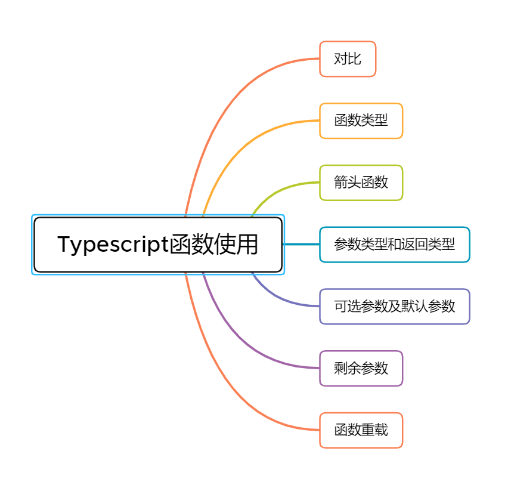

本次推文介绍的内容是typescript函数，在此并以JavaScript函数作为对比。

#### 1. TypeScript 函数与 JavaScript 函数的区别

| TypeScript      | JavaScript         |
| --------------- | ------------------ |
| 含有类型        | 无类型             |
| 箭头函数        | 箭头函数（ES2015） |
| 函数类型        | 无函数类型         |
| 必填和可 选参数 | 所有参数都是可选的 |
| 默认参数        | 默认参数           |
| 剩余参数        | 剩余参数           |
| 函数重载        | 无函数重载         |

#### 2. 函数类型

```typescript
// 方式一
let IdGenerator: (chars: string, nums: number) => string;

function createUserId(name: string, id: number): string {
  return name + id;
}

IdGenerator = createUserId;

// 方式二
let IdGenerator: (chars: string, nums: number) => string = function createUserId(name: string, id: number): string {
  return name + id;
}
```

- 一个完整的函数类型:**只包含两部分，参数类型和返回值类型**
- 参数类型的名字和函数参数的名字可以不一致，写成一致是为了增加该函数类型的可读性。
- 一边指定了类型但是另一边没有类型的话，TypeScript编译器会通过**类型推断**自动识别出类型。

#### 3. 箭头函数

##### 1.常见语法

```typescript
myBooks.forEach(() => console.log('reading'));

myBooks.forEach(title => console.log(title));

myBooks.forEach((title, idx, arr) =>
  console.log(idx + '-' + title);
);

myBooks.forEach((title, idx, arr) => {
  console.log(idx + '-' + title);
});
```

##### 2.使用示例

```typescript
// 未使用箭头函数
function Book() {
  let self = this;
  self.publishDate = 2016;
  setInterval(function () {
    console.log(self.publishDate);
  }, 1000);
}

// 使用箭头函数
function Book() {
  this.publishDate = 2016;
  setInterval(() => {
    console.log(this.publishDate);
  }, 1000);
}
```

#### 4. 参数类型和返回类型

- 函数的返回值类型除了返回原始类型之外，一般还会经常返回 any,nerver,void

```typescript
function createUserId(name: string, id: number): string {
  return name + id;
}
```

#### 5. 可选参数及默认参数

- 传递给一个函数的参数个数必须与函数期望的参数个数一致，编译器检查用户是否为每个参数都传入了值。
- 对于 JS 中经常遇到的一个函数调用时，对于声明时的入参可传可不传。我们可以使用 可选参数
- 默认参数也是可选参数

> **可选参数必须跟在必须参数后面**

```typescript
// 可选参数
function createUserId(name: string, id: number, age?: number): string {
  return name + id;
}

// 默认参数
function createUserId(
  name: string = "前端收割机",
  id: number,
  age?: number
): string {
  return name + id;
}
```

在声明函数时，可以通过 `?` 号来定义可选参数，比如 `age?: number` 这种形式。**在实际使用时，需要注意的是可选参数要放在普通参数的后面，不然会导致编译错误**。

#### 6. 剩余参数

- 将剩余的参数收敛到一个变量（编译器创建参数数组）里。并可对该变量进行访问

```typescript
function push(array, ...items) {
  items.forEach(function (item) {
    array.push(item);
  });
}

let a = [];
push(a, 1, 2, 3);
```

#### 7. 函数重载

函数重载或方法重载是使用相同名称和不同参数数量或类型创建多个方法的一种能力。

```typescript
function add(a: number, b: number): number;
function add(a: string, b: string): string;
function add(a: string, b: number): string;
function add(a: number, b: string): string;
function add(a: Combinable, b: Combinable) {
  // type Combinable = string | number;
  if (typeof a === 'string' || typeof b === 'string') {
    return a.toString() + b.toString();
  }
  return a + b;
}
```

在以上代码中，我们为 add 函数提供了多个函数类型定义，从而实现函数的重载。在 TypeScript 中除了可以重载普通函数之外，我们还可以重载类中的成员方法。

方法重载是指在同一个类中方法同名，参数不同（参数类型不同、参数个数不同或参数个数相同时参数的先后顺序不同），调用时根据实参的形式，选择与它匹配的方法执行操作的一种技术。所以类中成员方法满足重载的条件是：在同一个类中，方法名相同且参数列表不同。下面我们来举一个成员方法重载的例子：

```typescript
class Calculator {
  add(a: number, b: number): number;
  add(a: string, b: string): string;
  add(a: string, b: number): string;
  add(a: number, b: string): string;
  add(a: Combinable, b: Combinable) {
  if (typeof a === 'string' || typeof b === 'string') {
    return a.toString() + b.toString();
  }
    return a + b;
  }
}

const calculator = new Calculator();
const result = calculator.add('前端收割机', 'alan');
```

这里需要注意的是，当 TypeScript 编译器处理函数重载时，它会查找重载列表，尝试使用第一个重载定义。 如果匹配的话就使用这个。 因此，在定义重载的时候，一定要把最精确的定义放在最前面。另外在 Calculator 类中，`add(a: Combinable, b: Combinable){ }` 并不是重载列表的一部分，因此对于 add 成员方法来说，我们只定义了四个重载方法。
