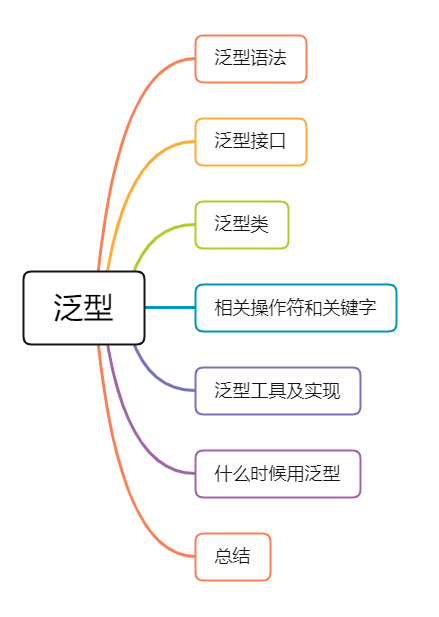

要创建一致的定义良好的 API，同时也要考虑可重用性。 组件不仅能够支持当前的数据类型，同时也能支持未来的数据类型，这在创建大型系统时为你提供了十分灵活的功能。

在像 Java 这样的语言中，可以使用泛型来创建可重用的组件，一个组件可以支持多种类型的数据。 这样用户就可以以自己的数据类型来使用组件。

设计泛型的关键目的是在成员之间提供有意义的约束，这些成员可以是：类的实例成员、类的方法、函数参数和函数返回值。

泛型（Generics）是允许同一个函数接受不同类型参数的一种模板。相比于使用 any 类型，使用泛型来创建可复用的组件要更好，因为泛型会保留参数类型。

#### 1 泛型语法

对于刚接触 TypeScript 泛型的读者来说，首次看到 `<T>` 语法会感到陌生。其实它没有什么特别，就像传递参数一样，我们传递了我们想要用于特定函数调用的类型。


参考上面的图片，当我们调用 ` identity<Number>(1)` ，`Number` 类型就像参数 `1` 一样，它将在出现 `T` 的任何位置填充该类型。图中 `<T>` 内部的 `T` 被称为类型变量，它是我们希望传递给 identity 函数的类型占位符，同时它被分配给 `value` 参数用来代替它的类型：此时 `T` 充当的是类型，而不是特定的 Number 类型。

其中 `T` 代表 **Type**，在定义泛型时通常用作第一个类型变量名称。但实际上 `T` 可以用任何有效名称代替。除了 `T` 之外，以下是常见泛型变量代表的意思：

- K（Key）：表示对象中的键类型；
- V（Value）：表示对象中的值类型；
- E（Element）：表示元素类型。

其实并不是只能定义一个类型变量，我们可以引入希望定义的任何数量的类型变量。比如我们引入一个新的类型变量 `U`，用于扩展我们定义的 `identity` 函数：

```typescript
function identity <T, U>(value: T, message: U) : T {
  console.log(message);
  return value;
}

console.log(identity<Number, string>(68, "Semlinker"));
```


除了为类型变量显式设定值之外，一种更常见的做法是使编译器自动选择这些类型，从而使代码更简洁。我们可以完全省略尖括号，比如：

```typescript
function identity <T, U>(value: T, message: U) : T {
  console.log(message);
  return value;
}

console.log(identity(68, "Semlinker"));
```

对于上述代码，编译器足够聪明，能够知道我们的参数类型，并将它们赋值给 T 和 U，而不需要开发人员显式指定它们。

#### 2 泛型接口

```typescript
interface GenericIdentityFn<T> {
  (arg: T): T;
}
```

#### 3 泛型类

```typescript
class GenericNumber<T> {
  zeroValue: T;
  add: (x: T, y: T) => T;
}

let myGenericNumber = new GenericNumber<number>();
myGenericNumber.zeroValue = 0;
myGenericNumber.add = function (x, y) {
  return x + y;
};
```

#### 4 相关操作符和关键字

为了方便开发者 TypeScript 内置了一些常用的工具类型，比如 Partial、Required、Readonly、Record 和 ReturnType 等。不过在具体介绍之前，我们得先介绍一些相关的基础知识，方便读者自行学习其它的工具类型。

##### 1.typeof

在 TypeScript 中，`typeof` 操作符可以用来获取一个变量声明或对象的类型。

```typescript
interface Person {
  name: string;
  age: number;
}

const sem: Person = { name: 'semlinker', age: 33 };
type Sem= typeof sem; // -> Person

function toArray(x: number): Array<number> {
  return [x];
}

type Func = typeof toArray; // -> (x: number) => number[]
```

##### 2.keyof

`keyof` 操作符是在 TypeScript 2.1 版本引入的，该操作符可以用于获取某种类型的所有键，其返回类型是联合类型。

```typescript
interface Person {
  name: string;
  age: number;
}

type K1 = keyof Person; // "name" | "age"
type K2 = keyof Person[]; // "length" | "toString" | "pop" | "push" | "concat" | "join" 
type K3 = keyof { [x: string]: Person };  // string | number
```

在 TypeScript 中支持两种索引签名，数字索引和字符串索引：

```typescript
interface StringArray {
  // 字符串索引 -> keyof StringArray => string | number
  [index: string]: string; 
}

interface StringArray1 {
  // 数字索引 -> keyof StringArray1 => number
  [index: number]: string;
}
```

为了同时支持两种索引类型，就得要求数字索引的返回值必须是字符串索引返回值的子类。**其中的原因就是当使用数值索引时，JavaScript 在执行索引操作时，会先把数值索引先转换为字符串索引**。所以 `keyof { [x: string]: Person }` 的结果会返回 `string | number`。

##### 3.in

`in` 用来遍历枚举类型：

```typescript
type Keys = "a" | "b" | "c"

type Obj =  {
  [p in Keys]: any
} // -> { a: any, b: any, c: any }
```

##### 4.infer

在条件类型语句中，可以用 `infer` 声明一个类型变量并且对它进行使用。

```typescript
type ReturnType<T> = T extends (
  ...args: any[]
) => infer R ? R : any;
复制代码
```

以上代码中 `infer R` 就是声明一个变量来承载传入函数签名的返回值类型，简单说就是用它取到函数返回值的类型方便之后使用。

##### 5.extends

有时候我们定义的泛型不想过于灵活或者说想继承某些类等，可以通过 extends 关键字添加泛型约束。

```typescript
interface Lengthwise {
  length: number;
}

function loggingIdentity<T extends Lengthwise>(arg: T): T {
  console.log(arg.length);
  return arg;
}
```

现在这个泛型函数被定义了约束，因此它不再是适用于任意类型：

```typescript
loggingIdentity(3);  // Error, number doesn't have a .length property
```

这时我们需要传入符合约束类型的值，必须包含必须的属性：

```typescript
loggingIdentity({length: 10, value: 3});
```

#### 5.泛型工具及实现

##### Partial

`Partial<T>` 的作用就是将某个类型里的属性全部变为可选项 `?`。

**定义：**

```typescript
/**
 * node_modules/typescript/lib/lib.es5.d.ts
 * Make all properties in T optional
 */
type Partial<T> = {
  [P in keyof T]?: T[P];
};
```

在以上代码中，首先通过 `keyof T` 拿到 `T` 的所有属性名，然后使用 `in` 进行遍历，将值赋给 `P`，最后通过 `T[P]` 取得相应的属性值。中间的 `?` 号，用于将所有属性变为可选。

**示例：**

```typescript
interface Todo {
  title: string;
  description: string;
}

function updateTodo(todo: Todo, fieldsToUpdate: Partial<Todo>) {
  return { ...todo, ...fieldsToUpdate };
}

const todo1 = {
  title: "Learn TS",
  description: "Learn TypeScript",
};

const todo2 = updateTodo(todo1, {
  description: "Learn TypeScript Enum",
});
```

在上面的 `updateTodo` 方法中，我们利用 `Partial<T>` 工具类型，定义 `fieldsToUpdate` 的类型为 `Partial<Todo>`，即：

```typescript
{
   title?: string | undefined;
   description?: string | undefined;
}
```

##### Required

功能和`Partial` 相反，是将类型的属性**「变成必填」**， 这里的 `-`指的是去除。 `-?` 意思就是去除可选，也就是必填啦。

```typescript
type Required<T> = { [P in keyof T]-?: T[P] };
```

##### Mutable

功能是将类型的属性**「变成可修改」**，这里的 `-`指的是去除。 `-readonly` 意思就是去除只读，也就是可修改啦。

```typescript
type Mutable<T> = {
  -readonly [P in keyof T]: T[P];
};
```

##### Readonly

功能和`Mutable` 相反，功能是将类型的属性**「变成只读」**， 在属性前面增加 `readonly` 意思会将其变成只读。

```typescript
type Readonly<T> = { readonly [P in keyof T]: T[P] };
```

##### ReturnType

功能是用来得到一个函数的返回值类型。

```typescript
type ReturnType<T extends (...args: any[]) => any> = T extends (
  ...args: any[]
) => infer R
  ? R
  : any;
```

下面的示例用 ReturnType 获取到 Func 的返回值类型为 string，所以，foo 也就只能被赋值为字符串了。

```typescript
type Func = (value: number) => string;

const foo: ReturnType<Func> = "1";
```

#### 6.什么时候用泛型

当我们的函数，接口或者类：

- 需要作用到很多类型的时候
- 需要被用到很多地方的时候


#### 7.总结

泛型和我们平时使用的函数是很像的，如果将两者进行横向对比，会很容易理解，很多函数的都关系可以迁移到泛型，比如函数嵌套，递归，默认参数等等。泛型是对类型进行编程，参数是类型，返回值是一个新的类型。我们甚至可以对泛型的参数进行约束，就类似于函数的类型约束。
