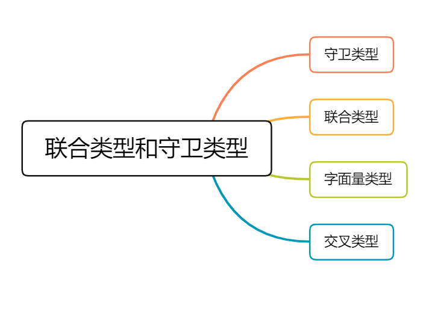

在文章的开头，笔者再次提醒小伙伴们，因为typescript是JavaScript的超集，所以说在掌握一定基础的JavaScript知识，学习typescript才会事半功倍噢。

本次我们将会讲述联合类型和类型守卫，在上一篇的推文中，有涉及到相关的概念，但是我们并没有深入。在本篇推文中，我们将会将知识点掰碎了，然后慢慢分析品尝。

### 一、守卫类型

**类型保护是可执行运行时检查的一种表达式，用于确保该类型在一定的范围内。** 换句话说，类型保护可以保证一个字符串是一个字符串，尽管它的值也可以是一个数值。类型保护与特性检测并不是完全不同，其主要思想是尝试检测属性、方法或原型，以确定如何处理值。目前主要有四种的方式来实现类型保护：

#### 1.1 in 关键字

```typescript
interface Admin {
  name: string;
  privileges: string[];
}

interface Person {
  name: string;
  startDate: Date;
}

type UnknownHuman = Person | Admin;

function printInformation(man: UnknownHuman) {
  console.log("Name: " + man.name);
  if ("privileges" in man) {
    console.log("Privileges: " + man.privileges);
  }
  if ("startDate" in man) {
    console.log("Start Date: " + man.startDate);
  }
}
```

#### 1.2 typeof 关键字

```typescript
function padLeft(value: string, padding: string | number) {
  if (typeof padding === "number") {
      return Array(padding + 1).join(" ") + value;
  }
  if (typeof padding === "string") {
      return padding + value;
  }
  throw new Error(`Expected string or number, got '${padding}'.`);
}
```

`typeof` 类型保护只支持两种形式：`typeof v === "typename"` 和 `typeof v !== "typename"`，`"typename"` 必须是 `"number"`， `"string"`， `"boolean"` 或 `"symbol"`。 但是 TypeScript 并不会阻止你与其它字符串比较，语言不会把那些表达式识别为类型保护。

#### 1.3 instanceof 关键字

```typescript
interface Padder {
  getPaddingString(): string;
}

class SpaceRepeatingPadder implements Padder {
  constructor(private numSpaces: number) {}
  getPaddingString() {
    return Array(this.numSpaces + 1).join(" ");
  }
}

class StringPadder implements Padder {
  constructor(private value: string) {}
  getPaddingString() {
    return this.value;
  }
}

let padder: Padder = new SpaceRepeatingPadder(6);

if (padder instanceof SpaceRepeatingPadder) {
  // padder的类型收窄为 'SpaceRepeatingPadder'
}
```

#### 1.4 自定义类型保护的类型谓词

```typescript
function isNumber(x: any): x is number {
  return typeof x === "number";
}

function isString(x: any): x is string {
  return typeof x === "string";
}
```

**函数返回类型设置和 `is` 的区别**：

- 使用 is 类型保护

```typescript
function isString(test: any): test is string{
    return typeof test === "string";
}

function example(foo: any){
    if(isString(foo)){
        console.log("it is a string" + foo);
        console.log(foo.length); // string function
        // 如下代码编译时会出错，运行时也会出错，因为 foo 是 string 不存在toExponential方法
        console.log(foo.toExponential(2));
    }
    // 编译不会出错，但是运行时出错
    console.log(foo.toExponential(2));
}
example("hello world");
```

- 函数返回类型设置

```typescript
function isString(test: any): boolean{
    return typeof test === "string";
}

function example(foo: any){
    if(isString(foo)){
        console.log("it is a string" + foo);
        console.log(foo.length); // string function
        // foo 为 any，编译正常。但是运行时会出错，因为 foo 是 string 不存在toExponential方法
        console.log(foo.toExponential(2));
    }
}
example("hello world");
```

### 二、联合类型

联合类型通常与 `null` 或 `undefined` 一起使用：

```typescript
const sayHello = (name: string | undefined) => {
  /* ... */
};
```

例如，这里 `name` 的类型是 `string | undefined` 意味着可以将 `string` 或 `undefined` 的值传递给`sayHello` 函数。

```typescript
sayHello("前端收割机");
sayHello(undefined);
```

通过这个示例，你可以凭直觉知道类型 A 和类型 B 联合后的类型是同时接受 A 和 B 值的类型。此外，对于联合类型来说，你可能会遇到以下的用法：

```typescript
let num: 1 | 2 = 1;
type EventNames = 'click' | 'scroll' | 'mousemove';
```

以上示例中的 `1`、`2` 或 `'click'` 被称为**字面量类型**，用来约束取值只能是某几个值中的一个。

### 三、字面量类型

#### 3.1 字符串字面量类型

字符串字面量类型其实就是字符串常量，与字符串类型不同的是它是具体的值：

```typescript
type Name = 'Tom'

let name1: Name = 'Bob' // error，不能将类型“"Bob"”分配给类型“"Tom"”
let name2: Name = 'Tom'
```

还可以使用联合类型来使用多个字符串

```typescript
type Fruit = 'apple' | 'pear' | 'orange' | 'banana'

let f1: Fruit = 'peach' // error，不能将类型“"peach"”分配给类型“Fruit”
let f2: Fruit = 'apple' 
```

#### 3.2 数字字面量类型

数字字面量类型和字符串字面量类型差不多，都是指定类型为具体的值：

```typescript
type Age = 18

let age1: Age = 17 // error，不能将类型“17”分配给类型“18”。
let age2: Age = 18
```

### 四、交叉类型

在 TypeScript 中交叉类型是将多个类型合并为一个类型。通过 `&` 运算符可以将现有的多种类型叠加到一起成为一种类型，它包含了所需的所有类型的特性。

```typescript
type PartialPointX = { x: number; };
type Point = PartialPointX & { y: number; };

let point: Point = {
  x: 1,
  y: 1
}
```

在上面代码中我们先定义了 `PartialPointX` 类型，接着使用 `&` 运算符创建一个新的 `Point` 类型，表示一个含有 x 和 y 坐标的点，然后定义了一个 `Point` 类型的变量并初始化。

#### 4.1 同名基础类型属性的合并

那么现在问题来了，假设在合并多个类型的过程中，刚好出现某些类型存在相同的成员，但对应的类型又不一致，比如：

```typescript
interface X {
  c: string;
  d: string;
}

interface Y {
  c: number;
  e: string
}

type XY = X & Y;
type YX = Y & X;

let p: XY;
let q: YX;
```

在上面的代码中，接口 X  和接口 Y 都含有一个相同的成员 c，但它们的类型不一致。对于这种情况，此时 XY 类型或 YX 类型中成员 c 的类型是不是可以是 `string` 或 `number` 类型呢？

答案是：`never`类型

为什么接口 X 和接口 Y 混入后，成员 c 的类型会变成 `never` 呢？这是因为混入后成员 c 的类型为 `string & number`，即成员 c 的类型既可以是 `string` 类型又可以是 `number` 类型。很明显这种类型是不存在的，所以混入后成员 c 的类型为 `never`。

#### 4.2 同名非基础类型属性的合并

在上面示例中，刚好接口 X 和接口 Y 中内部成员 c 的类型都是基本数据类型，那么如果是非基本数据类型的话，又会是什么情形。我们来看个具体的例子：

```typescript
interface D { d: boolean; }
interface E { e: string; }
interface F { f: number; }

interface A { x: D; }
interface B { x: E; }
interface C { x: F; }

type ABC = A & B & C;

let abc: ABC = {
  x: {
    d: true,
    e: 'semlinker',
    f: 666
  }
};

console.log('abc:', abc);
```

以上代码成功运行后，控制台会输出以下结果：


由上图可知，在混入多个类型时，若存在相同的成员，且成员类型为非基本数据类型，那么是可以成功合并。
