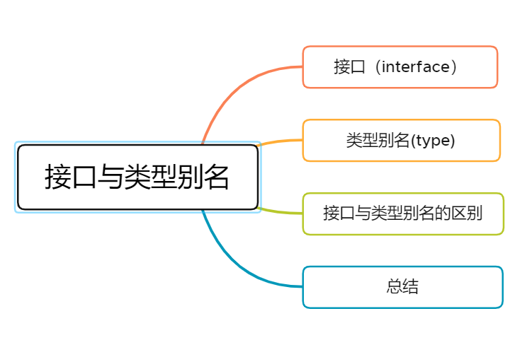

### 一、接口（interface）

在以往的面向对象语言中，例如Java，接口是一个很重要的概念，它是对行为的抽象，而具体如何行动需要由类去实现。

TypeScript 中的接口是一个非常灵活的概念，除了可用于对类的一部分行为进行抽象以外，也常用于对「对象的形状（Shape）」进行描述。

##### 1.对象的形状

```typescript
interface Person {
  name: string;
  age: number;
}

let alan: Person = {
  name: "alan",
  age: 18,
};
```

##### 2.只读属性

```typescript
interface Person {
  readonly name: string;
  age: number;
}
```

只读属性用于限制只能在对象刚刚创建的时候修改其值。

此外 TypeScript 还提供了 `ReadonlyArray<T>` 类型，它与 `Array<T>` 相似，只是把所有可变方法去掉了，因此可以确保数组创建后再也不能被修改。

```typescript
let a: number[] = [1, 2, 3, 4];
let b: ReadonlyArray<number> = a;
b[0] = 7; // error!
b.push(7); // error!
b.length = 77; // error!
a = b; // error!
```

##### 3.可选属性

```typescript
interface Person {
  name: string;
  age?: number;
}

let alan: Person = {
  name: "alan"
};
```

通过`？`标记的属性，成为了可选属性。当新建某一对象的时候，调用接口对该对象进行描述，对象中可选择是否含有可选属性。

##### 4.任意属性

有时候我们希望一个接口中除了包含必选和可选属性之外，还允许有其他的任意属性，这时我们可以使用 **索引签名** 的形式来满足上述要求。

```typescript
interface Preson {
    name: string;
    age?: number;
}
const person1:Preson = { name: "alan" }; // ok
const person2:Preson = { name: "alan", age: 18 }; // ok
const person3:Preson = { name: "alan", sex: 'man' } // error

// 方式1
let person1:Preson = {name: 'alan', age: 18, sex: 'man'};
let person2 = person1; // // 绕过：多余属性不报错


// 方式2
interface Person {
  name: string;
  age?: number;
  [propName: string]: any; // 任意属性
}

const person1:Preson = { name: "alan" }; //ok
const person2:Preson = { name: "alan", age: 18 }; //ok
const person3:Preson = { name: "alan", sex: 'man' } //ok
```

##### 5.函数属性

```typescript
interface FunctionInterface {
  ( parameter1: string, parameter2: number ): boolean;
}
// 代表函数两个参数的类型分别为字符串类型和数字类型，函数返回值类型为布尔值类型
```

##### 6.索引类型

```typescript
interface ArrayInterface {
  [index: number]: string;
} 
// 代表数组的下标为数字类型，数组元素为字符串类型

let myArray: ArrayInterface;
myArray = ["前端收割机", "alan"];
```

##### 7.类类型

```typescript
interface ClassInterface {
  currentTime: Date;
  setTime(data: Date);
}

class Clock implements ClassInterface {
  currentTime: Date;
  setTime(data: Date) {
      this.currentTime = data;
  }
  constructor(h: number, m: number) {...}
}
```

##### 8.多继承

```typescript
interface Animal {
    eat: string;
}

interface Person {
    say: string;
}

interface Man extends Animal, Person {
    play: string;
}

let man = <Man>{};
zoom.eat= `吃`;
zoom.say= `说`;
zoom.play= `玩`;
```


### 二、类型别名(type)

type 会给一个类型起个新名字。 type 有时和 interface 很容易混淆，但是，不同的是，type可以作用于原始值（基本类型），联合类型，元组以及其它任何你需要手写的类型。

起别名不会新建一个类型，它创建了一个新名字来引用那个类型。给基本类型起别名作用不大，但是可以做为文档的一种形式使用。

```typescript
type Name = string; // 基本类型

type NameFun = () => string; // 函数

type NameOrRFun = Name | NameFun; // 联合类型

function getName(n: NameOrRFun): Name {
    if (typeof n === 'string') {
        return n;
    } 
    return n();
}

```

同接口一样，类型别名也可以是泛型，我们可以添加类型参数并且在别名声明的右侧传入：

```typescript
type Container<T> = { value: T };
```

也可以使用类型别名来在属性里引用自己：

```typescript
type TreeNode<T> = {
    value: T;
    left: TreeNode<T>;    
    right: TreeNode<T>;
}
```

与交叉类型一起使用，我们可以创建出一些十分稀奇古怪的类型。

```typescript
type LinkedList<T> = T & { next: LinkedList<T> };

interface Person {
    name: string;
}

var people: LinkedList<Person>;
var s = people.name;
var s = people.next.name;
var s = people.next.next.name;
var s = people.next.next.next.name;
```

然而，类型别名不能出现在声明右侧的任何地方。

```typescript
type Yikes = Array<Yikes>; // error
```


### 三、接口与类型别名的区别

##### 1.相对于对象

```typescript
// interface
interface Point {
  x: number;
  y: number;
}

// type
type Point = {
  x: number;
  y: number;
};
```

##### 2.相对于函数

```typescript
// interface
interface SetPoint {
  (x: number, y: number): void;
}

// type
type SetPoint = (x: number, y: number) => void;
```

##### 3.相对于类

```typescript
// interface
interface Point {
  x: number;
  y: number;
}

class SomePoint implements Point {
  x: 1;
  y: 2;
}

// type
type Point2 = {
  x: number;
  y: number;
};

class SomePoint2 implements Point2 {
  x: 1;
  y: 2;
}
```

##### 4.相对于其他类型

与接口不同，类型别名还可以用于其他类型，如基本类型（原始值）、联合类型、元组。

```typescript
// primitive 基本类型（原始值)
type Name = string;


// union 联合类型
type PartialPoint = PartialPointX | PartialPointY;

// tuple 元组
type Data = [number, string];

// dom 节点
let div = document.createElement('div');
type B = typeof div;
```

##### 5.相对于扩展（extends）

- interface extends interface

```typescript
interface Name { 
  name: string; 
}
interface User extends Name { 
  age: number; 
}
```

- type extends type

```typescript
type Name = { 
  name: string; 
}
type User = Name & { age: number  };
```

- interface extends type

```typescript
type Name = { 
  name: string; 
}
interface User extends Name { 
  age: number; 
}
```

- type extends interface

```typescript
interface Name { 
  name: string; 
}
type User = Name & { 
  age: number; 
}
```

##### 6.相对于同名合并

interface 能够声明合并

```typescript
interface User {
  name: string
  age: number
}

interface User {
  sex: string
}

/*
User 接口为 {
  name: string
  age: number
  sex: string 
}
*/
```

##### 7.相对于计算属性

type 能使用 in 关键字生成映射类型，但 interface 不行。

语法与索引签名的语法类型，内部使用了 for .. in。 具有三个部分：

- 类型变量 K，它会依次绑定到每个属性。
- 字符串字面量联合的 Keys，它包含了要迭代的属性名的集合。
- 属性的结果类型。

```typescript
type Keys = "firstName" | "secondName"

type DudeType = {
  [key in Keys]: string
}

const test: DudeType = {
  firstName: "前端收割机",
  secondName: "alan"
}

// error!
interface DudeType2 {
  [key in keys]: string
}
```

### 四、总结

在很多场景下，interface 和 type都能使用，因此两者在很多时候会被混淆：

- 类型：对象、函数两者都适用，但是 type 可以用于基础类型、联合类型、元祖等。
- 同名合并：interface 支持，type 不支持。
- 计算属性：type 支持, interface 不支持。

最后，笔者会更加建议大家使用interface来实现需求。
